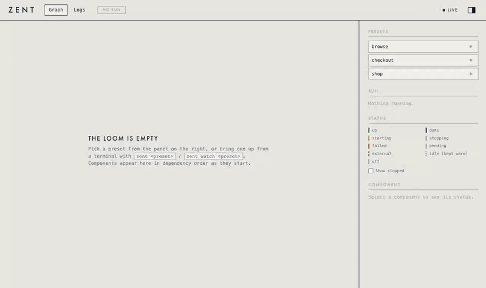

# zent

[](#quickstart)
[](#quickstart)
[](LICENSE)

> ⚠️ **Everything here is experimental.** APIs, CLI verbs, catalog format, on-disk state and
> docs can change or break at any time, with no migration path. Use at your own risk.



A Clojure/Jolt orchestrator for local dev environments. This repo is the engine
(`zent.*`: ordering, deploy, readiness, teardown, watch); what runs is a **catalog**, plain data
kept in a repo of its own (see "A catalog repo" below, `docs/resource-kinds.md` for what a
"kind" is).

## Quickstart

Install (macOS, Linux x86_64):

```
brew tap olivergg/zent https://github.com/olivergg/zent
brew trust --formula olivergg/zent/zent                  # Homebrew loads a third-party tap only once trusted
brew install --HEAD zent                                 # pulls jolt in; HEAD until a release is tagged
brew update && brew upgrade --fetch-HEAD zent            # later, to update; then, with a daemon up:
zent shutdown && zent serve --detach                     # move it onto the new version, keeping what runs
```

Then, from anywhere inside a catalog repo (below):

```
zent check                     # every preset validates
zent presets                   # what you can run
zent apply <preset>            # start it, wait until it settled
zent version                   # the installed zent (brew: HEAD-<sha>)
```

MCP: any client runs `zent mcp` (stdio) from inside the catalog repo - e.g. a committed
`.mcp.json` `{"mcpServers": {"zent": {"command": "zent", "args": ["mcp"]}}}` for Claude
Code. A client starting it elsewhere sets `ZENT_CATALOG` to the repo's path.

To work on the engine itself, run a clone instead: `ln -s $PWD/bin/zent ~/.local/bin/zent`,
on a PATH entry ahead of Homebrew's.

## A catalog repo

```
catalog.edn      {:name :acme :defaults {...} :components {...}}  (zent.catalog)
presets/*.edn    one preset per file, named after it
```

Plain data, no code and no deps: `zent` runs the catalog repo enclosing the current directory
(the first parent with a `catalog.edn`, or `$ZENT_CATALOG`) with the engine it was installed
from. `zent check` validates every preset (a catalog's test).

## Running it

```
zent presets                   # list presets (* = active, + = yours)
zent preview <preset>          # what it would run, and change in what runs now
zent apply <preset>            # start it (starts the daemon if needed), wait until settled
zent status                    # per-component state
zent logs [-f] <component>
zent stop [<component>]        # :permanent components stay up
zent serve --detach --ui       # daemon + dashboard on http://127.0.0.1:8765
```

The dashboard's **Logs** tab (`/#logs`) streams the components' output, interleaved and
coloured per component, container output included. Pills work like a chart legend (click:
only this one, again: all; ctrl/cmd-click: add or remove), and filters (`text`, `/regexp/`,
warnings, errors) live in the URL.

Presets live under the catalog's `presets/*.edn`, one file per preset. Use `127.0.0.1`, not
`localhost`, for the dashboard: IPv6-first resolution hangs the websocket. Never run a bare
`zent down` to clean up: the session also tracks stacks you started yourself.

## For Java/Python developers

Using zent means reading and editing data, not writing Clojure. Only the engine
(`src/zent/`) needs the language.

| zent | Closest familiar thing |
|---|---|
| catalog (`catalog.edn`) | one big `docker-compose.yml` declaring every service you could run |
| component (`:broker`, `:webapp`...) | a service in that file |
| `:deps` | `depends_on`, but waits until the dependency is actually ready |
| preset | a Spring/Maven profile: "today I run these 4 services" |
| daemon | a supervisor (`systemd`, `pm2`): starts, watches, restarts |
| `:kind` | `:docker-compose`, `:quarkus-app` (`mvn package`, then the built jar), `:one-shot` (seed script), `:k8s`, `:external` (you run it from your IDE; zent only waits for it) |

### EDN in one minute

EDN is Clojure's data format, the role JSON plays for JavaScript:

| EDN | JSON / Python | |
|---|---|---|
| `:broker` | `"broker"` | keyword: an identifier, like an enum constant |
| `{:port 9090 :repo "x"}` | `{"port": 9090, "repo": "x"}` | map; no `:` between key and value, commas optional |
| `[:a :b]` | `["a", "b"]` | vector (list) |
| `#{:a :b}` | `{"a", "b"}` (Python set) | set |
| `;; text` | `# text` | comment |
| `nil` | `null` / `None` | |

A catalog component, then the same in YAML:

```clojure
:broker-seed
{:kind :one-shot                 ; runs once, then ends as done
 :repo "broker-stack"            ; ~/workspace/broker-stack
 :scripts ["./SeedSchemas.java" "./ApplyTopics.java"]
 :deps [:broker :broker-connect]
 :watch {:paths ["."] :exts [".avsc" ".java"]}}  ; re-run when a schema changes
```
```yaml
broker-seed:
  kind: one-shot
  repo: broker-stack
  scripts: [./SeedSchemas.java, ./ApplyTopics.java]
  deps: [broker, broker-connect]
  watch: {paths: [.], exts: [.avsc, .java]}
```

A preset is a vector of component names; a map right after a name overrides it:

```clojure
[:webapp-deps
 :front {:branch "feature/x"}                ; run from a worktree of origin/feature/x
 :webapp {:kind :external                    ; running in IntelliJ
          :readiness {:type :http-poll
                      :url "http://localhost:8080/health/readiness"}}]
```

Why EDN rather than JSON or YAML:

- **Comments**, which JSON lacks. The catalog relies on them to explain the reason behind each value.
- **No indentation rules or implicit typing.** In YAML, `no` turns into `false` and `3.10` into
  `3.1`, and indentation errors are silent. In EDN a string is always quoted, and brackets set the structure.
- **Richer types.** Keywords (`:broker`) are distinct from strings, and sets are built in.
- **Safe to read.** `clojure.edn/read-string` never evaluates code: a catalog and its presets
  are pure data, so a catalog repo holds no code at all.

### Typical day

1. Clone the repos you need into `~/workspace/` (zent never clones).
2. `preview`, then `apply` (a dry run first, like `terraform plan`: with a daemon up, it lists
   what would stop, start or redeploy, and why). `apply` starts each component
   once its dependencies are ready, up to 3 at once (local builds one at a time), and returns
   once all are.
3. Run your own service in the IDE, if the preset marks it `:external`.
4. Switch with `apply <other-preset>`. Whatever it doesn't name is stopped, except
   `:keep-warm` (e.g. a broker) and `:permanent` (e.g. `webapp-deps`) components.

## One runtime: Jolt

[Jolt](https://github.com/jolt-lang/jolt) is Clojure hosted on Chez Scheme instead of the
JVM - no JVM startup cost, so `zent <preset>` responds like a real binary instead of paying
a JVM boot every time. It's this project's only runtime: needs its own install (`jolt` on
your PATH, separate from `clj`), reads straight from `src`/`test`/`resources`, no build step.

HTTP deps are Jolt-native too: `jolt-lang/ring-chez-adapter` (server + websockets),
`jolt-lang/http-client` (the CLI's client), `clojure.data.json` - see `zent.ui.server`'s
docstring for why not http-kit/cheshire.

Never call `jolt` directly unless you're debugging the engine itself; `zent` (`bin/zent`) is what
every doc and docstring here means by "`zent <verb>`".

## Daemon and CLI

`zent serve --detach` runs the resident daemon in the background (output in
`~/.cache/zent/serve.log`, `zent attach` follows it). Every other verb - `apply`, `status`,
`stop`, `reload`, `shutdown`, ... (full list in `zent.cli`) - is a client of its HTTP API,
same as the dashboard; `zent apply <preset>` starts the daemon if none runs. The address
and write token live in `~/.cache/zent/daemon.edn` (0600, see `zent.daemon`).

Presets of your own (`zent preset save <name> '<edn>'`, or by prompt through MCP) live in
`~/.config/zent/presets/<catalog>/`, are validated against the catalog and registered with a
running daemon on save. Unlike the catalog's own presets they may only pick components and set
harmless keys (`schema/runtime-preset-keys`: branch, image, port, context...), never what code
runs - otherwise a prompt could reach around every allowlist with a `:cmd`.

Secrets: a component's catalog entry may point env vars at k8s Secrets (`:secret-env`, read
from contexts in `:allow-secret-contexts` only); a preset switches them on with
`:use-secret-env true` and can't change what that component runs. Values go to the process env
only, and the daemon masks them in `/api/logs` (what the MCP `logs` tool reads).

`zent mcp` is an MCP server on stdio exposing the same verbs as tools (`zent.mcp`); setup in
"Quickstart".

## Design docs

- `docs/resource-kinds.md` - the mechanisms a component can run as (`:docker-compose`,
  `:process`, `:external`, ...).
- `docs/watch-design.md` - live reload (why polling, not a native watcher).

## Tests

```
jolt test/runner.clj
```

Jolt only: the HTTP deps bind Jolt internals (`jolt.ffi`, `jolt.io-poller`), so `clj` can't
load the project.

## License

Copyright 2026 Olivier G. Licensed under the [Apache License 2.0](LICENSE).
